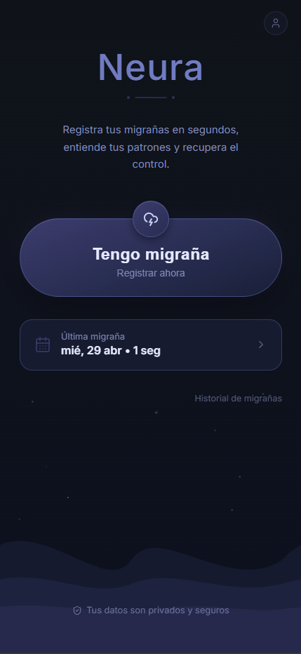
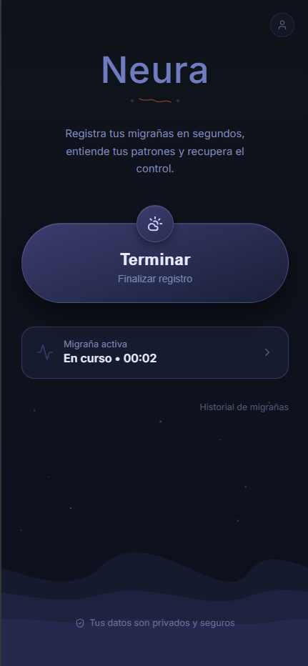
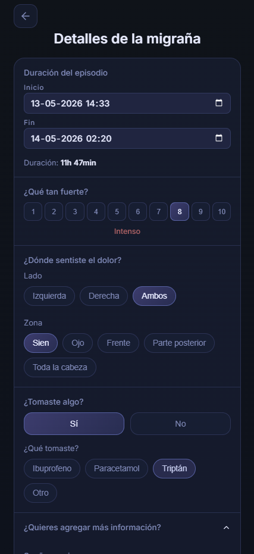
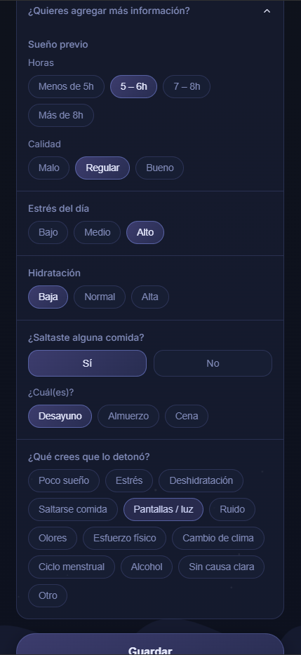
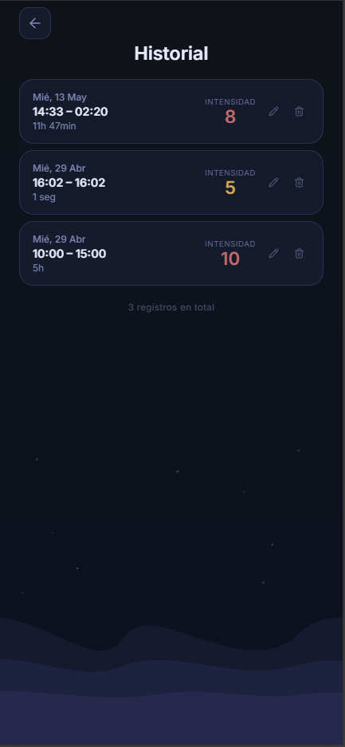

# Neura

Neura es una app web para registrar migrañas con la menor fricción posible. Está pensada para usarse incluso durante una crisis: la pantalla principal prioriza un único CTA, "Tengo migraña", para iniciar el registro en segundos.

Demo: [relaxed-nasturtium-db5011.netlify.app](https://relaxed-nasturtium-db5011.netlify.app/)

## Qué Hace

- Inicia una sesión de migraña con un toque.
- Permite terminar la sesión y revisar la duración antes de guardarla.
- Registra intensidad, ubicación del dolor, medicación y contexto opcional.
- Guarda historial local de episodios, ordenado del más reciente al más antiguo.
- Permite editar o eliminar registros existentes.
- Mantiene los datos en el dispositivo mediante Redux Persist.

## Capturas

Neura está diseñada como una experiencia mobile-first, calmada y de baja carga visual para registrar episodios incluso durante una crisis.

| Inicio | Migraña activa |
|---|---|
|  |  |

| Detalles | Contexto | Historial |
|---|---|---|
|  |  |  |

## Flujo Principal

1. La persona toca `Tengo migraña` cuando comienza un episodio.
2. Mientras la sesión está activa, el CTA cambia a `Terminar` y la app muestra el tiempo en curso.
3. Al terminar, Neura abre el formulario de revisión para ajustar fechas y agregar detalles.
4. El registro queda disponible en el historial para consulta, edición o eliminación.

## Datos Registrados

Cada episodio puede incluir:

- Inicio y fin del episodio.
- Intensidad del dolor, de 1 a 10.
- Lado y zona del dolor.
- Medicación tomada y detalle libre si corresponde.
- Contexto opcional: sueño, estrés, hidratación, comidas saltadas y posible detonante.

## Stack

- React 19
- TypeScript
- Vite
- React Router
- Redux Toolkit
- Redux Persist
- Lucide React

## Comandos

```bash
npm run dev             # Inicia el servidor local en el puerto 5173
npm run build           # TypeScript check + build de Vite
npm run lint            # Ejecuta ESLint
npm run preview         # Previsualiza el build de producción
npm run build:waves-on  # Build con animación de ondas
npm run build:waves-off # Build sin animación de ondas
```

## Estructura

```text
src/main.tsx                 # Entrada: Redux, PersistGate y Router
src/app/router/              # Configuración de rutas
src/app/store.ts             # Store de Redux y persistencia
src/features/migraine/       # Feature principal de registro de migrañas
src/shared/components/       # Componentes compartidos
src/styles/index.css         # Tokens y estilos globales
```

## Diseño

La guía visual vive en `.agents/skills/neura-design/SKILL.md`. Antes de cambiar UI, layout, colores, tipografía o jerarquía visual, usa esa skill como fuente de verdad.

La prioridad de diseño de Neura es reducir carga cognitiva durante una migraña activa: bajo ruido visual, contraste amable y el CTA principal siempre como elemento dominante.
